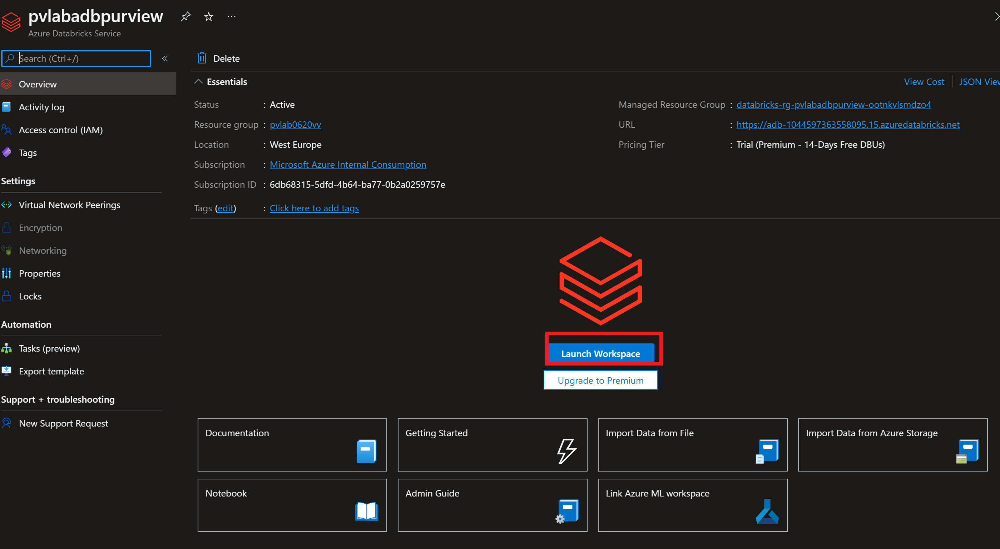
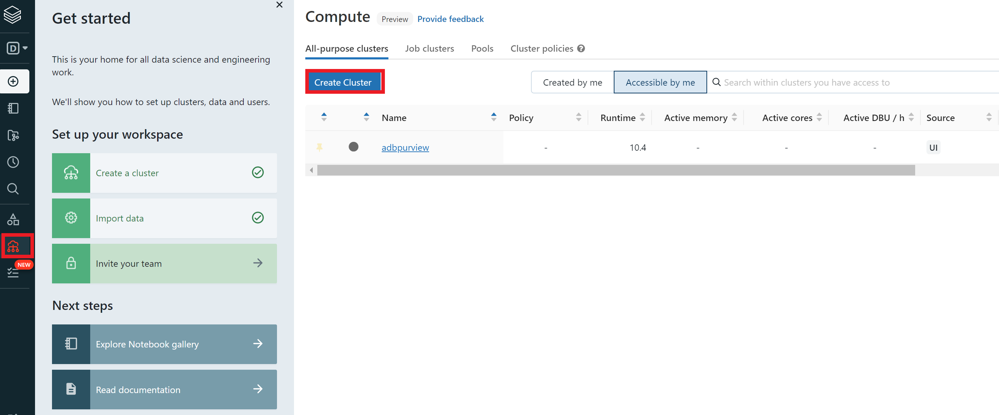
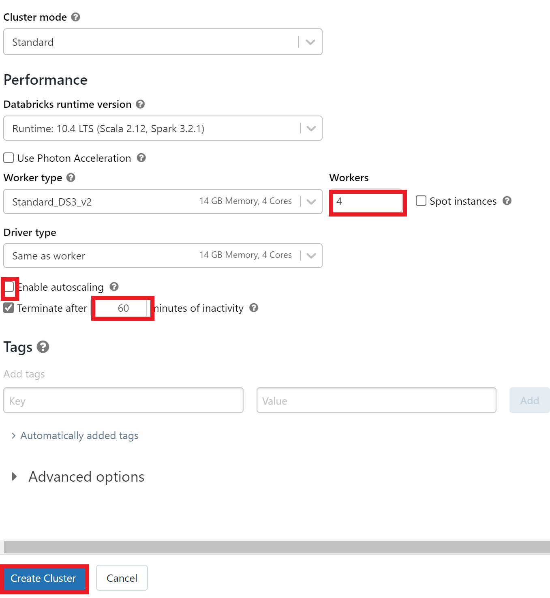

# Module 15 - PyApacheAtlas using Azure Databricks

[< Previous Module](../modules/module09.md) - **[Home](../README.md)** - [Next Module >](../modules/module11.md)

## :loudspeaker: Introduction

In the previous module we have seen using Rest API inorder to create Purview assets. In this module we will introduce you to using the Pyapache atlas SDK to programmatically interact with Purview. Spark and Python are now becoming the defacto standard for data processing and the Pyapache atlas SDK provides easy to use packages for programmatic creation of spark assets and interaction with the purview workspace. The SDK provides relevant methods to:

* Authenticate to Microsoft Purview using Service Principal
* Creating Entities, Relationships and performing updates 
* Working with classifications.
* Extracting Purview assests for dependency management.

The primary focus of this module is to be able to create Spark Entity types or that are not available out of the box in the purview workspace or create  other assets that may be specific to an organization that require customization.

## :thinking: Prerequisites

* An [Azure account](https://azure.microsoft.com/free/) with an active subscription.
* An Azure Databricks workspace
* A Microsoft Purview account (see [module 01](../modules/module01.md)).
* Completion of steps 2, 3 and 4 from Module 10 (see [module 10](../modules/module10.md))

## :hammer: Tools

* [PyApacheAtlas](https://pypi.org/project/pyapacheatlas/) (will be used to download the library into Azure databricks)

## :dart: Objectives

* Understand the high-level PyApache Atlas SDK.
* Authenticate into Microsoft Purview from Azure Databricks.
* Create (custom) spark entities.
* Associate the entities and establish relationships during data processing

## Table of Contents

1. [Register an Application, Generate a client secret](#1-register-an-application)
2. [Provide service principal access to Storage account and create an output containner](#2-provide-access-and-create-container)
3. [Create and launch Databricks workspace](#3-create-launch-databricks)
4. [Create a spark cluster](#4-create-spark-cluster)
6. [Download the Pyapache Library to the cluster]
7. [Create a Notebook]
8. Import the relevant packages and Connect to the Purview workspace from the databricks spark environment
9. Create a dataframe from an existing databricks dataset
10. Create a custom entity type to represent a spark dataframe

## 1. Register an Application, Generate a client secret

1. Please make sure to complete steps 2, 3 and 4 from Module 10 (see [module 10](../modules/module10.md)). AT this point, you should have clinetId, tenantID and secret. This information will be used to authentication the the following steps.

## 2. Provide service principal access to Storage account and create an output containner 
 
 1. Navigate to your Azure Data Lake Storage Gen2 account (e.g. `pvlab{randomId}adls`) and select **Access Control (IAM)** from the left navigation menu.

    

2. Click **Add role assignment**.

    

3. Filter the list of roles by searching for `Storage Blob Data Reader`, click the row to select the role, and then click **Next**.

    

4. Under **Assign access to**, select **User, group, or service principal**, click **+ Select members**, select **Microsoft Purview account** from the **Managed Identity** drop-down menu, select the service principal (e.g. purview-spn`), click **Select**. Finally, click **Review + assign**.

    

5. Click **Review + assign** once more to perform the role assignment.

    

6. To confirm the role has been assigned, navigate to the **Role assignments** tab and filter the **Scope** to `This resource`. You should be able to see that the Microsoft Purview managed identity has been granted the **Storage Blob Data Reader** role.

    

7. Navigate to the containers blade on the storage account and click the '+ Container' 
    Add screenshot

## 3. Launch Databricks workspace and create a spark cluster

1. Navigate to your databricks workspace and launch the workspace by clicking the 

2. You will now be redirected to the workspace where you can create spark cluster and notebooks. In this step, we will create a spark cluster by navigating to the "Compute" Link in the left navigation menu. You will then see the "Create Cluster" link as shown below

You will now see a section that shows how you can configure your cluster. Please enter the info as shown in the screenshot. (We are using all default settings, except. Autoscaling is disabled, Max nodes =4 and Terminate after 60 min of in acttivity)
 
 
